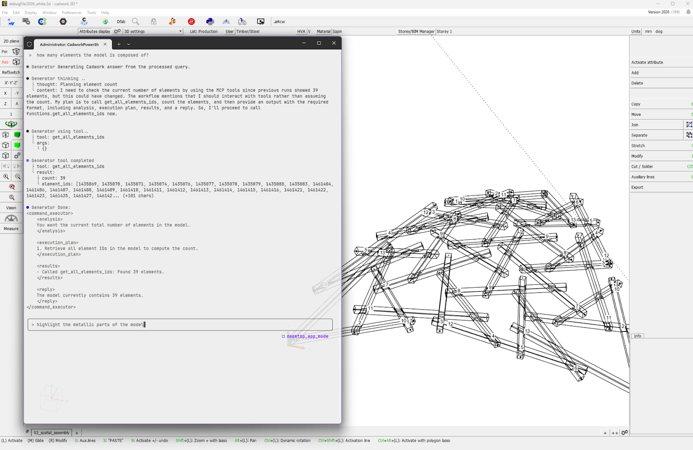
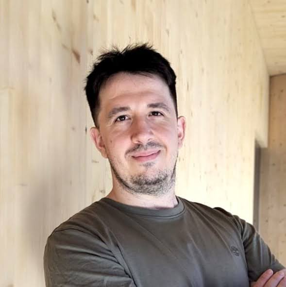
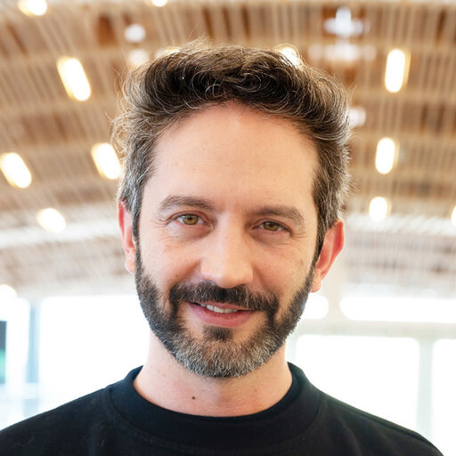
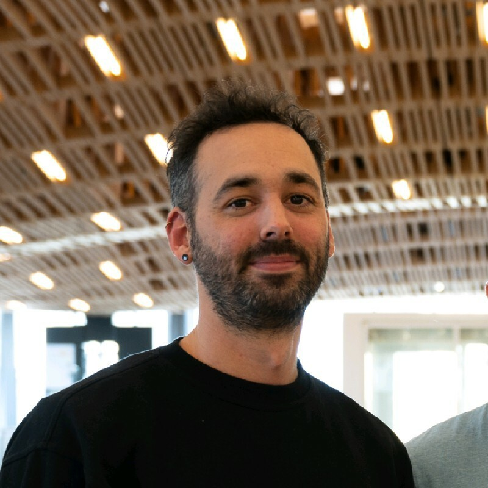

# Bit-2-Beam: Toward Future Pipelines for Timber Construction

> **Future of Construction 2026 Workshop**

* **Date:** May 20, 2026
* **Instructors:** Andrea Settimi, Panayiotis Papacharalambous, Gonzalo Casas, Chen Kasirer
* **Keywords:** AI CAD, Timber design, CNC fabrication, Timber engineering

## Overview

This workshop presents an experimental timber construction pipeline integrating cutting-edge technologies from both academic and industry research.
Participants will design using COMPAS Timber, transfer models into Cadwork for production planning showcasing emerging AI integration, and kick-start fabrication processes through Antikythera, connecting design data to CNC machining and interactive extended reality visualization.

This speculative pipeline demonstrates a possible future where open-source tools and industry software become truly interoperable. The workshop reveals current potentials, advantages, and bottlenecks, offering participants a tangible preview of how bleeding-edge technologies could transform timber construction pipelines as academia and industry converge.

## Workshop Structure & Activities

The workshop is organized as a hands-on exploration of a speculative but executable timber construction pipeline. Participants work in small groups to engage with computational design, production planning, and fabrication-oriented systems, combining short practical tasks with demonstrations and guided discussion.

1. **Design**: Participants first explore reciprocal frames structures in COMPAS Timber, adjusting parameters and inspecting how design intent and material logic are encoded and transferred downstream.
2. **Planning**: The timber models are then imported into Cadwork, where a demonstration of ongoing AI research capabilities will be conducted to explore the model’s metadata, manipulate this information, and generate additional data that can be embedded into the model for the subsequent fabrication phase. This demonstration will highlight how AI can support and automate data-driven decision-making within the design process.
3. **Fabrication**: Finally, the design will be sent to the fabrication pipeline to mill the parts in the large 5-axes CNC machine in the Robotic Fabrication Lab, and utilize XR technologies to visualize and assist during parts’ assembly.

**Expected Outcomes**
Participants gain practical understanding of COMPAS Timber design, AI integration challenges in timber construction (including realistic capabilities versus aspirations), and actionable insights for adopting bleeding-edge technologies in timber production environments. Participants will experience the end-to-end fabrication workflow, and will produce a small real-world prototype of a reciprocal timber frame structure.

## Target Audience

* Architects, timber engineers, computational designers (research or industry).
* **Experience Level**:
  * Computational design experience and familiarity with Grasshopper is expected.
  * Python programming knowledge is not required but is a plus.
* **Class Size**: ~5-15 participants.

## Agenda

| Time | Topic/Task | Notes |
| :---- | :---- | :---- |
| 09:00-10:00 | Intro / Installations | |
| 10:00-11:00 | COMPAS Timber | |
| 11:00-12:00 | Antikythera | |
| 12:00-13:00 | Lunch | |
| 13:00-14:00 | Cadwork AI step | Intro to AI in CAD for timber design |
| 14:00-15:00 | Cadwork AI step | Showcase of Cadwork AI |
| 15:00-16:00 | Fabrication | |
| 16:00-17:00 | Fabrication | |
| 17:00+ | Apero | |

## Overview of the pipeline

1. Design in COMPAS Timber using reciprocal frame structures Grasshopper file.
2. Send to Cadwork AI MVP.
3. Integrated COMPAS Timber + Cadwork AI data.
4. Send to Antikythera to kick-off fabrication:
   * Timber model to Machine integration using (Easy Hops / COMPAS Dust).
   * AR Assembly agent for Antikythera using participants’ phones (QR code for localization of CNC and assembly location, stock → pick up with AR → placement with AR).

## Team

### Andrea Settimi

Software developer in the Timber Construction Development department at Cadwork Informatik, leading AI development and integration for timber construction workflows. PhD graduate from EPFL’s Chair of Timber Construction (IBOIS), specializing in computer vision and digital fabrication. Contributor to open-source tools for computational design, extended reality, and fabrication, with hands-on background in timber projects as both planner and builder.

* **ORCID-ID**: [https://orcid.org/0001-5020-7331](https://orcid.org/0000-0001-5020-7331)
* **LinkedIn**: [Profile](https://www.linkedin.com/in/andrea-settimi-57a411114/)

### Panayiotis Papacharalambous

Architect and computational designer contributing to open-source software for timber construction. Develops tools and digital pipelines within the COMPAS ecosystem to support research and applied practice in the timber sector. Brings hands-on experience with robotic and machine-based fabrication to the design of fabrication-aware workflows. Holds a Diploma of Architect Engineer from the Aristotle University of Thessaloniki and an MAS in Architecture and Digital Fabrication from ETH Zürich.

* **ORCID-ID**: [https://orcid.org/0009-0007-7256-658X](https://orcid.org/0009-0007-7256-658X)
* **LinkedIn**: [Profile](https://www.linkedin.com/in/panayiotis-papacharalambous-1907911b8/)

### Gonzalo Casas

Software engineer and open-source contributor specializing in digital fabrication and computational design. Lecturer of “Coding Architecture I–II” and core developer of the COMPAS framework. Over a decade of teaching and workshop experience, including work within NCCR Digital Fabrication, focusing on software workflows for architecture and fabrication.

* **ORCID-ID**: [https://orcid.org/0000-0002-2061-1533](https://orcid.org/0000-0002-2061-1533)
* **LinkedIn**: [Profile](https://linkedin.com/in/gonzalocasas)

### Chen Kasirer

Software engineer developing open-source tools for AEC and core developer of the COMPAS Framework. Focused on bridging research and industry through thoughtful software design. Experienced in software architecture, digital fabrication, and applied engineering. Previously worked in automotive cybersecurity, virtualization consulting, and IT engineering. Holds a BSc in Computer Science from Ulm University with specialization in both computer graphics & vision and computer engineering.

* **ORCID-ID**: [https://orcid.org/0009-0009-0699-8442](https://orcid.org/0009-0009-0699-8442)
* **LinkedIn**: [Profile](https://www.linkedin.com/in/chen-kasirer/)

## License

Unless explicitely mentioned, all content in this repository is licensed under the MIT License. See the [LICENSE](LICENSE) file for details.
